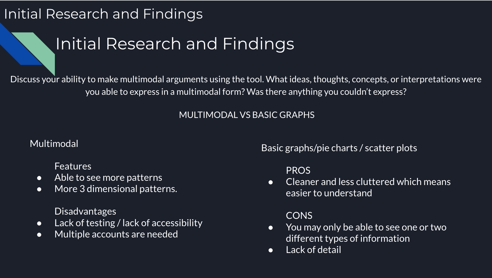
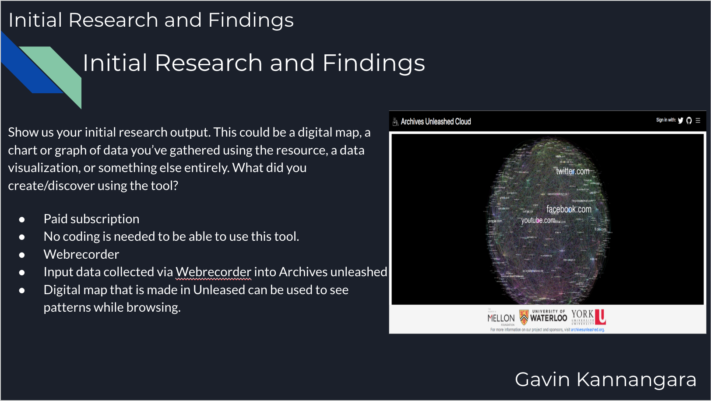

# IASC-2P02 / Gavin Kannangara 

## About me 
My name is Gavin Kannangara and I am an interactive arts and science student in second year going into third year. One specific research area/ interest of mine is data visualization because I am personally a better visual learner so I would love to focus on just taking data and putting it into some sort of digital visualization system. My current portfolio shows that I want to focus on Data visualization because as of right now I have done a research paper and a group project based around data gathered around that was in a digitally visualized format. For my essay I used data visualization tools like Voyant which allows you to take a piece of text and then input it into the tool and analyze it for world patterns, commons words and much more.  In the future I only hope to incorporate more and more data in a visual format no matter what project I may be working on. I personally feel like when I use data visualization tools my work is more organized and I myself am able to make a better argument or statement in my project. I find that data visualization also kind of helps me get my thoughts together which leads to me being more organized when trying to work on a project or essay.  
 

 

https://guides.github.com/pdfs/markdown-cheatsheet-online.pdf
## Abstract

Thesis: The reason why the digital humanities still to this day cannot be categorized or labeled is due to the fact that it holds people that come together from different types of media studies and that is why it cannot be categorized. What makes the digital humanities are the fact that we interpret, collaborate and make new things and that is what makes up a group of digital humanists who they are. 
My approach for this was to argue that we as Digital humanist can’t just use our own data to conclude our research. Our job as a digital humanist is to take and make our own data and then make a concluding remark on some research.  My research overall could have been done better but I still did find some very interesting stuff which would eventually help me prove my point. I found statements made by places like Duke University which I really did useful and was able to implement into my essay quiet well. This also proved to me that this was a topic of interest not only for me but for a lot people that were wanted answers as to what makes up the DH. Throughout the year I was really confused as to what the digital humanities really consisted of and who can be considered a digital humanist, but after having taken 2p02 and doing research papers like I have done I believe that I have a grasp on what the digital humanities really are. 

After getting my results back from my paper it was said that I had made some very broad. Statements such as “Digital humanists think outside the box like no other group of scholars ever will and this is what makes the digital humanities important in today’s world because it is this type of thinking and scholarship which will allow people to move forward and do bigger and better things.” Through doing this research paper/ blog post my out look has obviously changed and I learned a lot by simply looking into what the digital humanities really are and what and who can be considered a digital humanist. After getting back results on the paper many of the changes that I could make to my paper was to be more specific and go into detail with some of the statements that I had made and now going back and reading my work over agin I can now see why the statements that I made can be seen as confusing and or unclear and in turn did not support the points I was trying to make in my research. I think doing deeper research and having to write a paper on the digital humanities and who and what makes up the community was very helpful in terms of me actually coming to understand the whole concept itself. Seeing other peoples views on the whole topic and comparing it to my out looks also was very eye opening and put me in the shoes of other s and allowed me to see things from a different point of view which made my understanding of the topic more balanced and equal to both side of views. I made changes to the first paragraph, which you can see [here](https://github.com/gavink1/IASC-2P02-/commit/e856d8dc3305235a33117e90e587479c9bc53159). I also made changes to the second paragraph, which you can see [here](https://github.com/gavink1/IASC-2P02-/commit/34bd900eb380907d1f7f51975bfe5f9c9e1cce46). I also made some changes again to the second and third paragraphs, which you can see [here](https://github.com/gavink1/IASC-2P02-/commit/4db6947a3df9de6aa341ee7873ce8b64eefe0af8). Overall these changes show x and y changes in my thinking.

## Blog post

Ramsay and Drucker's critique of Moretti should be taken to heart by digital humanists: any reliance on externally-produced data sets should be abolished in the field. Instead, each digital humanist will show the interpretive methods used to produce their unique data sets, and no two scholars will ever use the same data to conduct their research. Doing so will allow digital scholarship to fully embrace its humanities background, foregrounding subjective experience above all else. Established datasets are for scientists, and they have no place in humanities research. All data should be interpretively created.

digital humanities vs everyone

Digital humanists are naturally encouraged to interpretively create data sets while out in the field doing research but it does not mean that established datasets are to be completely disregarded. Digital humanist should create their own data and compare it alongside established datasets and compare the data that was collected by themselves to what other researchers find to see how different media studies view a certain case of study. The reason why the digital humanities still to this day cannot be categorized or labeled is due to the fact that it holds people that come together from different types of media studies and that is why it cannot be categorized. What makes the digital humanities are the fact that we interpret, collaborate and make new things and that is what makes up a group of digital humanists who they are. 

The digital humanities base itself on the idea of interpretation and it’s the way in which digital humanist interpret things that differentiates us from any other new or old media study groups. Digital humanists think outside the box like no other group of scholars ever will and this is what makes the digital humanities important in today's world because it is this type of thinking and scholarship which will allow people to move forward and do bigger and better things. What I mean by thinking outside the box is about how digital humanist use technology and tools such as data visualization tools that could help us see patterns and themes in texts or readings for example that could help us find new meaning in those texts. The use of such tools helps digital humanist see things in different ways which could lead to us finding new keys to problems in todays world which would in turn help the world move forward. As for what I meant by “ bigger and better things” was things that are produced by the type of thinking a digital humanist would have. One example could be Drucker’s graphs. Her graphs was a new and possibly a better way of displaying data compared to the traditional pie charts and regular graphs. This is what I mean by bigger and better things, when people think outside the box and come up with ways of doings things in ways that others probably would’t have can bring change to the world and help people see things in new ways. For example Drucker in her paper Humanities Approaches to Graphical Display she states “Creating bar charts with ambiguity and degrees of uncertainty or other variables in them might cause champions of legibility and transparency some unease, but the shift away from standard metrics to metrics that express interpretation is an essential move for humanists and/or constructivists across disciplines.” It’s clear when reading Drucker’s paper that in this day and age a lot of people still rely on old ways of representing data to display their research, But the argument that a digital humanist like Drucker is making is that with the research that is being done today with the technology that is available, researchers are only crippling themselves by trying to display their data on a typical graph. This does not mean in any way that the research being done is in any way incorrect or should be disregarded by us, digital humanist. We as digital humanist should gather our own data and other researchers data and use our skills with computers to be able to showcase the research that is being done to the best ability so that other people may be able to interpret the data that is being presented as close to as it was intended to be.  

According to Duke University “the Digital Humanities are unified by its emphasis on connecting”. I personally believe that what this means is that digital humanist more often than not connect with other people to solve a problem or conduct research.  When the term digital humanities are thrown around what comes to mind is a group of people who have knowledge with different types of technologies that help people conduct and display research coming together to put all of their knowledge together. A person who can go out into the field do their research and interpret their work and still take into regard other peoples research at the same time and acknowledged other peoples outlooks on a certain subject or study is someone that should be seen as a Digital Humanist. For this reason, a digital humanist should not be completely disregarding data sets that may come from other forms of study or groups like scientists. I believe that our job as digital humanist is to take all the information that we can get whether that be someones or our own and then present it in new and interactive ways. This is where I think Drucker’s ideas came into play and was a good representation of what work by a digital humanist should look like. What Drucker took some data and presented in new ways which would allow people to intemperate the information they are being presented in new ways. This type of data visualization gets people thinking and that is what I believe the job of Digital humanists is to do, to get people to think in new ways, in ways that will allow them to come up with new solutions to problems. We as digital humanist should learn to interpret data but at the same time still, take into consideration other forms of study and just acknowledge the fact that it is there and that it does exist. If a digital humanist can do that it will allow them to connect with other people and see things from different points of view and be able to conduct and present better research while out in the field.  I believe that digital humanist should naturally be more open minded people to every thing around us, we shouldn’t turn a blind eye to everything else that is going on around us and just focus on our data that we are collecting and not keep and eye out for all the other studies that different faculties are doing. We as Digital humanist should use all our resources that are out there regardless of whether it comes from within the DH or not and I believe that being able to do that is what would make one person a digital humanist compared to someone that only considers their own research when putting together data and research.  

As digital humanists, we are constantly making new things and looking for new ways to advance the way research and data are done through technology.  In Drucker's paper, we see a series of graphs that are made to show different types of data in a more 3-dimensional type of way which made the data more capable of being interpreted differently by an individual that is looking at the data graphs. When Drucker's text is put into Voyant we see that some of the more commonly used words are subjective and interpretation. The conclusion that can be made from this is the fact that the data that is being created especially in the graphs that Drucker provided can be interpreted differently by different people. Data is subjective because different people will look at it differently based on their personal outlooks and this can be said for any type of data that is presented in any way no matter if it comes from within the DH or not and that is why we as Digital humanist shouldn’t disregard any sort of data that is presented to us while trying to conduct research of our own. If we assume that data can be interpreted differently to begin with regardless of the way the data is being presented to different people, then why hold back on the way the graphs are put together. This brings into question of how valid Drucker’s graphs are and it proves that maybe displaying information in the way that Drucker has could actually be beneficial to people that are looking for data on any sort of topic. 

In conclusion, we as Digital Humanists should be striving to get out there and conduct research in different ways and at the same time acknowledge the other forms of studies that exist and take into consideration the research and data that is being presented. The traits that make a person a Digital Humanist is a person who interprets, collaborate and make new things while out in the field trying to create their own interpretive data. 

<iframe style='width: 580px; height: 463px;' src='https://voyant-tools.org/?corpus=d82b3f9b36c78f0adb00f46c8e3a9719&visible=55&view=Cirrus'></iframe>

Work cited 

“Digital Humanities: Defining Digital Humanities.” LibGuides, guides.library.duke.edu/digital_humanities.

Drucker, Johanna. “Graphical Approaches to the Digital Humanities.” A New Companion to Digital Humanities, 2015, pp. 238–250., doi:10.1002/9781118680605.ch17.

## collaborative project 

Show us your initial research output. This could be a digital map, a chart or graph of data you’ve gathered using the resource, a data visualization, or something else entirely. What did you create/discover using the tool? 
Paid subscription 

No coding is needed to be able to use this tool.  

Webrecorder 

Input data collected via Webrecorder into Archives unleashed

Digital map that is made in Unleased can be used to see patterns while browsing.

Discuss your ability to make multimodal arguments using the tool. What ideas, thoughts, concepts, or interpretations were you able to express in a multimodal form? Was there anything 	you couldn’t express?
 MULTIMODAL VS BASIC GRAPHS 
Multimodal 

Features 
Able to see more patterns

More 3 dimensional patterns.


Disadvantages 
Lack of testing / lack of accessibility

Multiple accounts are needed  

Basic graphs/pie charts / scatter plots

PROS
Cleaner and less cluttered which means easier to understand 


CONS 
You may only be able to see one or two different types of information

Lack of detail


Project description
Our project was to look into a tool called archives unleashed which is a web recorder that keeps track of all the websites some one may visit throughout the course of a day and then puts that information/data into a visual format which then some one could use to see patterns of someones work flow or browsing patterns throughout the day. We decided to research this data visualization projects simply because we thought it sounded cool and we wanted to see if we could actually find cool patterns in our own web browsing that we otherwise wouldn’t notice or find.  Unfortunately we came to find out that this app requires a paid membership and a request and permission in order to be able to actually use the tool so we were only able to get baseline information about how using this tool would actually look. 

Collaboration statement 
I thought working with a team for this project was very helpful especially because we had to figure out how one specific data visualization tool would have worked. Working in a group really helped because we were able to figure things out as a group and since I was a part of a group of four we we able to use our different styles of thinking and different ways of problem solving to get the most information that we could get out of the data visualization tool we had chosen to research. I thinking working in a group really enriches my academic thinking because I get to see how different people look at different problems and seeing that gives me insight. Being able to learn from others especially your own classmates or teammates is really cool and allows you to grow as a team member.  The one thing I find that is the most important when working with a team is communication. If your team does not communicate then none of the work will line up and everything will be all over the place. The way me and my team kept in touch while trying to get this project done was through discord which is a online chat/voice call app. We chose this application simply because all of our group members had this application and used it on a pretty regular basis which made it really easy to keep in touch. 

## solo presentation 

[title of presentaion](reveal/index.html)

